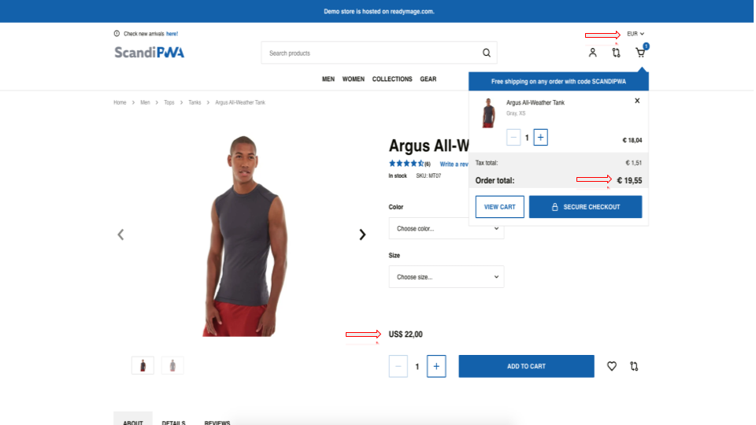

# 🛍️ Projeto: Luma Magento e-Commerce

## 📌 Visão Geral

**Objetivo:** Validar a qualidade, usabilidade e funcionalidade do e-commerce *Luma (Magento Demo)*, garantindo que fluxos críticos como Cadastro, Login, Busca e Checkout funcionem conforme esperado para o usuário final.

Este projeto simulou um ambiente real de sprint de QA, cobrindo desde o planejamento estratégico até a execução de testes e reporte de defeitos.

**Ferramentas Utilizadas:**

- **Gestão de Testes:** Docs
- **Report de Bugs:** Docs
- **Navegadores:** Chrome e Firefox
- **Técnica:** Caixa Preta (Black Box)

---

## 🗺️ Estratégia de Teste

A abordagem focou em **Testes Funcionais, de Usabilidade e Compatibilidade**. Utilizei a técnica de particionamento de equivalência para cobrir cenários positivos e negativos.

**Escopo Validado:**

- ✅ **Cadastro e Autenticação:** Criação de conta, Login, Recuperação de senha.
- ✅ **Navegação e Busca:** Filtros, Categorias e Barra de pesquisa.
- ✅ **Fluxo de Compra:** Adição ao carrinho, Edição de itens, Checkout (Endereço e Pagamento).
- ✅ **Minha Conta:** Edição de perfil e Histórico de pedidos.

---

## 🧪 Casos de Teste (Destaques)

Abaixo, alguns dos principais cenários executados durante o ciclo de testes.

| ID        | Cenário                       | Passos Resumidos                                                    | Resultado Esperado                               | Status            |
| :-------- | :---------------------------- | :------------------------------------------------------------------ | :----------------------------------------------- | :---------------- |
| **TC001** | **Cadastro com Sucesso**      | 1. Acessar cadastro 2. Preencher dados válidos 3. Submeter          | Redirecionar para "Minha Conta" e enviar e-mail. | ✅ Aprovado        |
| **TC005** | **Login com E-mail Inválido** | 1. Inserir e-mail sem "@" 2. Tentar logar                           | Mensagem de erro "Incorrect email format".       | ✅ Aprovado        |
| **TC004** | **Checkout sem Logar**        | 1. Adicionar item 2. Ir ao checkout 3. Preencher dados 4. Finalizar | Gerar número de ordem (Order ID) com sucesso.    | ✅ Aprovado        |
| **TC001** | **Conversão de Moeda**        | 1. Alterar moeda para EUR 2. Verificar preços                       | Preços devem ser atualizados para Euro.          | ❌ Falhou (BUG001) |

---

## 🐞 Bugs Reportados (Top Defeitos)

Durante a execução, foram identificadas falhas críticas que impactam a receita e a experiência do usuário.

### 🔴 [CRÍTICO] BUG-004 - Produtos com Preço Zerado (US$ 0,00)

**Impacto:** Permite que clientes adquiram produtos sem custo, gerando prejuízo financeiro direto.
**Cenário:** Navegação na Home e Categorias.
**Resultado Atual:** Diversos itens (ex: *Luma Yoga For Life*) estão listados como **US$ 0,00**.

> **Evidência:**
> 

---

### 🟠 [GRAVE] BUG-001 - Falha na Conversão de Moeda

**Impacto:** Confunde o usuário internacional e impede a finalização correta da compra em outras moedas.
**Passos para Reproduzir:**

1. Selecionar moeda "EUR" no cabeçalho.
2. Adicionar produto ao carrinho.
**Resultado Atual:** O valor no carrinho permanece em Dólar (USD) ou não realiza a conversão correta, exibindo inconsistência visual.

> **Evidência:**
> 

---

### 🟡 [MÉDIO] BUG-005 - Aceitação de Caracteres Especiais no Login

**Impacto:** Segurança e integridade de dados.
**Descrição:** O sistema permite caracteres especiais antes do "@" no campo de e-mail durante o login, o que deveria ser bloqueado pela validação de regex.

---

## 📉 Métricas Finais do Ciclo

| Métrica                          | Resultado                                                  |
| :------------------------------- | :--------------------------------------------------------- |
| **Total de Cenários Planejados** | 35                                                         |
| **Taxa de Execução**             | 100%                                                       |
| **Taxa de Aprovação**            | ~85%                                                       |
| **Defeitos Encontrados**         | 5 Documentados neste ciclo (2 Críticos, 1 Grave, 2 Médios) |

---
📫 **QA Responsável:** [Danilo Melin](https://github.com/DaniloMelin)
